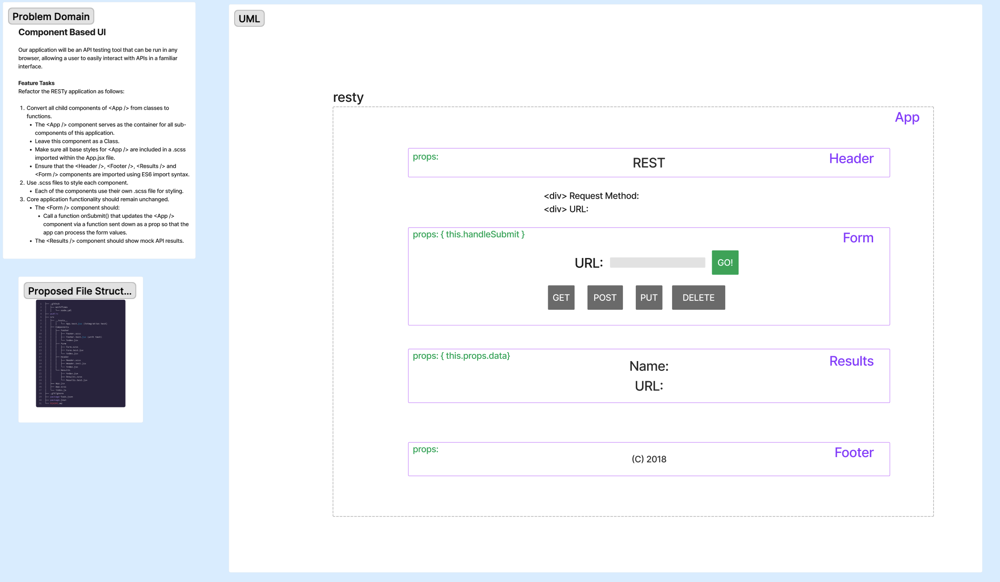

# LAB - Class 26

## Project: Component Based UI

### Author: Heather Holcomb | 401d53

### Problem Domain

Our application will be an API testing tool that can be run in any browser, allowing a user to easily interact with APIs in a familiar interface.

- Phase 1: Application Setup
  - Basic React Application
  - Scaffolding
  - Basic State
  - Rendering

### Links and Resources

- [GitHub Actions ci/cd](https://github.com/holcombheather/resty/actions)
- [Deployed link on codesandbox.io]()

### Collaborators

- Referenced demo code from Class 26 lecture taught by Ryan Gallaway

### Setup

1. Clone this repo into your local environment
2. `npm i`
3. `npm start`

#### `.env` requirements (where applicable)

- `PORT` - 3001
- `DATABASE_URL` - see `.env.sample`

#### How to initialize/run your application (where applicable)

- `npm start` or `nodemon`

#### How to use your library (where applicable)

#### Features / Routes

Phase 1 Requirements
1. Convert all child components of `<App />` from classes to functions.
  - The `<App />` component serves as the container for all sub-components of this application.
  - Leave this component as a Class.
  - Make sure all base styles for `<App />` are included in a .scss imported within the App.jsx file.
  - Ensure that the `<Header />`, `<Footer />`, `<Results />` and `<Form />` components are imported using ES6 import syntax.
2. Use .scss files to style each component.
  - Each of the components use their own .scss file for styling.
3. Core application functionality should remain unchanged.
  - The `<Form />` component should:
  - Call a function onSubmit() that updates the `<App />` component via a function sent down as a prop so that the app can process the form values.
  - The `<Results />` component should show mock API results.

#### Tests
- Not required for Lab 26
- `npm test`

#### UML

